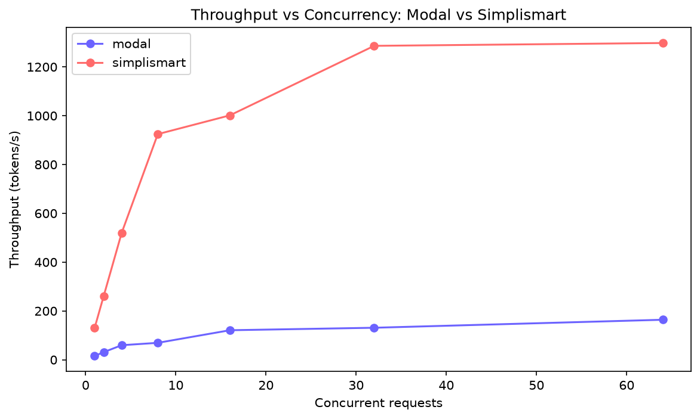
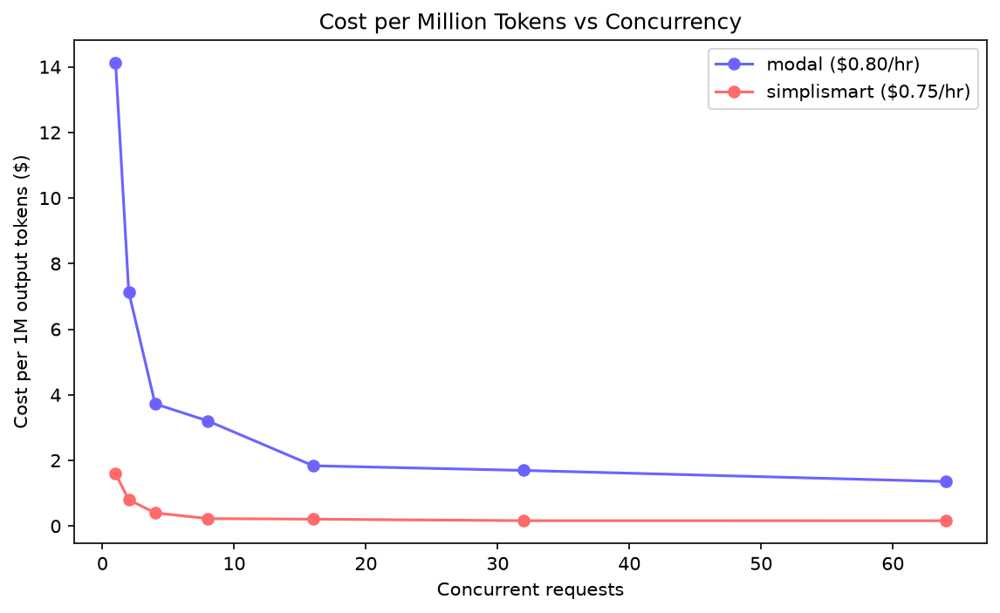
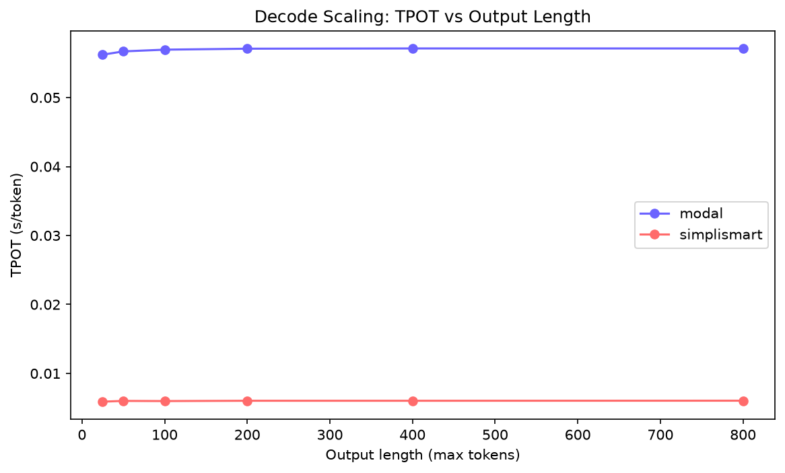
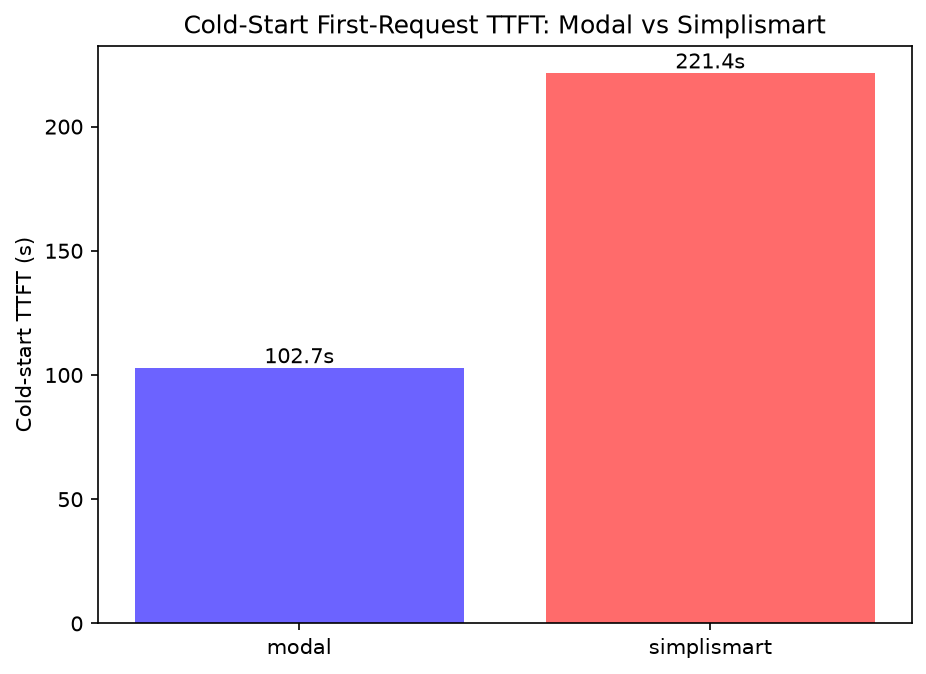
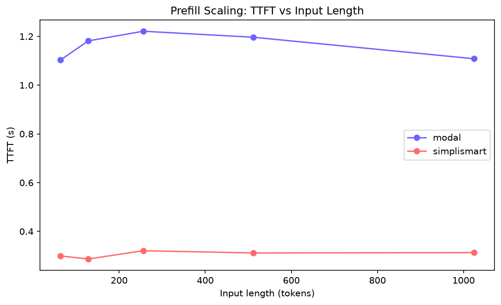
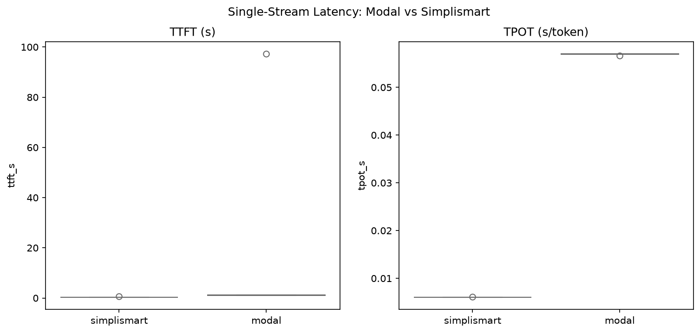

# Benchmarking LLM Inference: Simplismart vs Modal
**Adhitya Ganesh · Qwen2.5-7B-Instruct · July 2026**

## 1. Approach

I deployed the same model on both platforms via code (Claude Code, never the UIs) and drove both through one async harness pointed at each by swapping base_url — possible because both expose an OpenAI-compatible endpoint. Changing only the platform makes every difference attributable to the platform, not the method. Every metric is split into the two phases of inference: prefill (compute-bound, sets TTFT) and decode (memory-bound, sets TPOT). Six tests ran on both: single-stream latency, concurrency sweep (1–64), input & output sweeps, cold-start, and cost-per-token.

Assumptions: Qwen2.5-7B substituted for gated Llama-3.1-8B (ungated, same class). Modal ran on L4 (~$0.80/hr); Simplismart's free tier only had A10 quota (H100/A100/L4 = zero available), priced at an assumed $0.75/hr. Same 24GB VRAM class, so the comparison is fair. Samples are small (few hundred), so figures are directional.

## 2. Findings

| Metric | Modal (L4, vanilla vLLM) | Simplismart (A10, custom) |
|---|---|---|
| Warm TTFT | 1.11s | 0.284s |
| Warm TPOT | 57ms/tok | 6ms/tok |
| Peak throughput | 164 tok/s | 1298 tok/s |
| Cost / 1M tokens | $1.36 | $0.16 |
| Cold start | 103s | 221s |

Simplismart sustains ~8× Modal's throughput and shows a clear saturation knee at c≈32; Modal's L4 stays nearly flat.

Cost falls ~8× on both as concurrency amortizes the GPU, but Simplismart sits ~8× lower throughout.

Why: Simplismart's ~9× TPOT edge comes from FP8 + custom CUDA kernels + continuous batching + KV-cache optimization — the exact levers that govern memory-bound decode. This is their business model: they price per-token but pay per-GPU-hour, so throughput-per-GPU is their margin — and the cost chart confirms they deliver it.

TPOT is dead-flat on both platforms across 25→800 output tokens — clean confirmation that decode is a constant, memory-bound step.

Modal wins cold-start (103s vs 221s): its lighter container boots faster, while Simplismart's ahead-of-time compilation costs startup time. A genuine startup-vs-steady-state tradeoff.

Caveat (honest):

TTFT stayed flat (even dipped) with input length rather than rising — because at 64–1024 tokens, prefill is too cheap to dominate; TTFT is fixed overhead here. Longer prompts (8K+) would be needed to show prefill scaling. Also, one Modal warm-latency run leaked a 97s cold-start artifact

; I excluded it and report the clean p50 (1.11s) separately — isolating cold from warm is core to a fair benchmark.

## 3. Agentic UX: Problems & Fixes

Simplismart — the deploy compiled on H100 then failed at deploy with "need 1.0 but only 0.0 available", with no way to see my quota beforehand. I had to write a probe script trying each GPU to discover only A10/V100 were available. Fix: expose a quota pre-flight; make the error list what IS available. The compile step also cycled OPTIMISING for minutes with no ETA. Fix: show compile progress.

Modal — full control but a high code floor; every deploy is a Python module. Long, user-owned cold starts. Fix: a higher-level "serve an OpenAI LLM" template.

## 4. Learnings, AI Approach, Reflections

The prefill/decode split explains everything — once I saw decode is memory-bound, the 9× TPOT gap, the flat output sweep, and why FP8 on a weaker GPU beats vanilla vLLM all followed. An optimized engine beats hardware: Simplismart won ~8× on the same GPU class.

AI approach: I used a reasoning model to first build a rigorous inference reference, used it to design the benchmark, then drove Claude Code to scaffold, deploy, run, and chart everything. I owned design, cost decisions, and interpretation; the agent owned execution — including writing the quota-probe when H100 failed and flagging the leaked cold-start artifact.

Interesting: the cost chart is the business model made visible — 8× cheaper because 8× higher throughput-per-GPU. Difficult: the Simplismart quota wall, and holding cost discipline (cheapest GPU, scale-to-zero, tear down and verify after every step) under time pressure.

Repo: github.com/Adhityaganesh/Simplismart-Assignment
